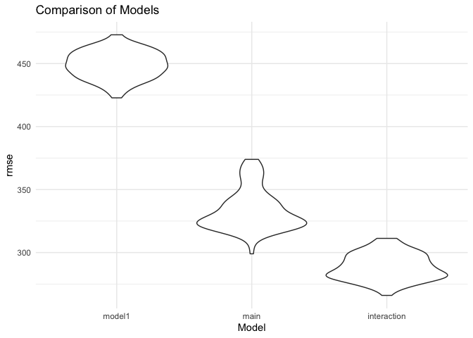
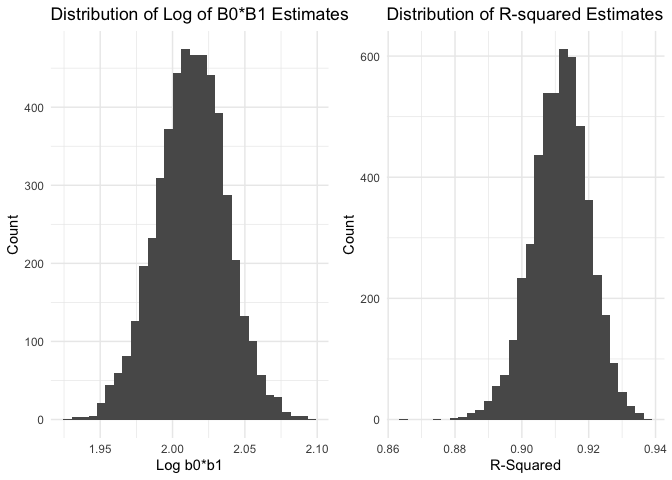

p8105\_hw6\_cq2207
================
Carolina Q Cardoso
11/19/2019

``` r
library(tidyverse)
```

    ## ── Attaching packages ───────────────────────────────────────────────────────────────────────── tidyverse 1.2.1 ──

    ## ✔ ggplot2 3.2.1     ✔ purrr   0.3.2
    ## ✔ tibble  2.1.3     ✔ dplyr   0.8.3
    ## ✔ tidyr   1.0.0     ✔ stringr 1.4.0
    ## ✔ readr   1.3.1     ✔ forcats 0.4.0

    ## ── Conflicts ──────────────────────────────────────────────────────────────────────────── tidyverse_conflicts() ──
    ## ✖ dplyr::filter() masks stats::filter()
    ## ✖ dplyr::lag()    masks stats::lag()

``` r
library(ggplot2)
library(modelr)
library(mgcv)
```

    ## Loading required package: nlme

    ## 
    ## Attaching package: 'nlme'

    ## The following object is masked from 'package:dplyr':
    ## 
    ##     collapse

    ## This is mgcv 1.8-28. For overview type 'help("mgcv-package")'.

``` r
library(patchwork)
```

# Problem 1

*Load and clean the data for regression analysis*

``` r
bwt =
  read.csv("./data/birthweight.csv") %>%
  janitor::clean_names() %>%
  mutate(
    babysex = factor(babysex, levels = c(1, 2), labels = c("male", "female")),
    frace = factor(frace, levels = c(1, 2, 3, 4, 8, 9), labels = c("white", "black", "asian", "puerto rican", "other", "unknown")),
    malform = factor(malform, levels = c(0, 1), labels = c("absent", "present")),
    mrace = factor(mrace, levels = c(1, 2, 3, 4, 8, 9), labels = c("white", "black", "asian", "puerto rican", "other", "unknown")),
    premature = if_else(gaweeks>37, "not premature", "premature")
  )
```

*Propose a regression model for birthweight.This model may be based on a
hypothesized structure for the factors that underly birthweight, on a
data-driven model-building process, or a combination of the two.
Describe your modeling process and show a plot of model residuals
against fitted values – use add\_predictions and add\_residuals in
making this plot:*

The proposed model below was based on my knowledge and experience with
predictors of negative pregnancy outcomes, such as low birthweight.
These include, maternal pre-pregnancy weight, maternal weight gained,
gestational age in weeks, and presence of malformations. Malformation
was included in the final model, regardless of its significance, because
of its clinical relevance to this issue.

``` r
model1 = lm(bwt ~ ppwt + wtgain + gaweeks + malform, data = bwt)

summary(model1)
```

    ## 
    ## Call:
    ## lm(formula = bwt ~ ppwt + wtgain + gaweeks + malform, data = bwt)
    ## 
    ## Residuals:
    ##      Min       1Q   Median       3Q      Max 
    ## -1735.28  -281.48     4.61   291.69  1535.54 
    ## 
    ## Coefficients:
    ##                Estimate Std. Error t value Pr(>|t|)    
    ## (Intercept)    -33.4084    92.9468  -0.359    0.719    
    ## ppwt             4.5038     0.3388  13.293   <2e-16 ***
    ## wtgain           9.6188     0.6304  15.258   <2e-16 ***
    ## gaweeks         60.3484     2.1835  27.639   <2e-16 ***
    ## malformpresent -21.8017   115.8644  -0.188    0.851    
    ## ---
    ## Signif. codes:  0 '***' 0.001 '**' 0.01 '*' 0.05 '.' 0.1 ' ' 1
    ## 
    ## Residual standard error: 447.7 on 4337 degrees of freedom
    ## Multiple R-squared:  0.2365, Adjusted R-squared:  0.2358 
    ## F-statistic: 335.8 on 4 and 4337 DF,  p-value: < 2.2e-16

``` r
#plot residuals

bwt %>%
modelr::add_residuals(model1) %>%
modelr::add_predictions(model1) %>% 
ggplot(aes(x = pred, y = resid)) + 
  geom_point(alpha = 0.5, color = "light blue") + geom_hline(yintercept = 0, color = "red") + 
  labs(
    title = "Residuals Against Fitted Values",
    x = "Predicted Birtweight (grams)",
    y = "Residuals"
   ) +
  theme_set(theme_minimal() + theme(legend.position = "top"))
```

<!-- -->

*Compare your model to two others. Make this comparison in terms of the
cross-validated prediction
error.:*

``` r
#One using length at birth and gestational age as predictors (main effects only)

model_main = lm(bwt ~ blength + gaweeks, data = bwt)
summary(model_main)
```

    ## 
    ## Call:
    ## lm(formula = bwt ~ blength + gaweeks, data = bwt)
    ## 
    ## Residuals:
    ##     Min      1Q  Median      3Q     Max 
    ## -1709.6  -215.4   -11.4   208.2  4188.8 
    ## 
    ## Coefficients:
    ##              Estimate Std. Error t value Pr(>|t|)    
    ## (Intercept) -4347.667     97.958  -44.38   <2e-16 ***
    ## blength       128.556      1.990   64.60   <2e-16 ***
    ## gaweeks        27.047      1.718   15.74   <2e-16 ***
    ## ---
    ## Signif. codes:  0 '***' 0.001 '**' 0.01 '*' 0.05 '.' 0.1 ' ' 1
    ## 
    ## Residual standard error: 333.2 on 4339 degrees of freedom
    ## Multiple R-squared:  0.5769, Adjusted R-squared:  0.5767 
    ## F-statistic:  2958 on 2 and 4339 DF,  p-value: < 2.2e-16

``` r
#One using head circumference, length, sex, and all interactions (including the three-way interaction) between these

model_inter = lm(bwt ~ bhead + blength + babysex + bhead*blength + bhead*babysex + blength*babysex + bhead*blength*babysex, data = bwt)
summary(model_inter)
```

    ## 
    ## Call:
    ## lm(formula = bwt ~ bhead + blength + babysex + bhead * blength + 
    ##     bhead * babysex + blength * babysex + bhead * blength * babysex, 
    ##     data = bwt)
    ## 
    ## Residuals:
    ##      Min       1Q   Median       3Q      Max 
    ## -1132.99  -190.42   -10.33   178.63  2617.96 
    ## 
    ## Coefficients:
    ##                               Estimate Std. Error t value Pr(>|t|)    
    ## (Intercept)                 -7176.8170  1264.8397  -5.674 1.49e-08 ***
    ## bhead                         181.7956    38.0542   4.777 1.84e-06 ***
    ## blength                       102.1269    26.2118   3.896 9.92e-05 ***
    ## babysexfemale                6374.8684  1677.7669   3.800 0.000147 ***
    ## bhead:blength                  -0.5536     0.7802  -0.710 0.478012    
    ## bhead:babysexfemale          -198.3932    51.0917  -3.883 0.000105 ***
    ## blength:babysexfemale        -123.7729    35.1185  -3.524 0.000429 ***
    ## bhead:blength:babysexfemale     3.8781     1.0566   3.670 0.000245 ***
    ## ---
    ## Signif. codes:  0 '***' 0.001 '**' 0.01 '*' 0.05 '.' 0.1 ' ' 1
    ## 
    ## Residual standard error: 287.7 on 4334 degrees of freedom
    ## Multiple R-squared:  0.6849, Adjusted R-squared:  0.6844 
    ## F-statistic:  1346 on 7 and 4334 DF,  p-value: < 2.2e-16

``` r
#Cross Validation

cv_df = 
  crossv_mc(bwt, 100) %>%
  mutate(
        train = map(train, as_tibble),
        test = map(test, as_tibble)
        ) %>%
  mutate(model1  = map(train, ~lm(bwt ~ ppwt + wtgain + gaweeks + malform, data=.x)),
         model_main  = map(train, ~lm(bwt ~ blength + gaweeks, data=.x)),
         model_inter  = map(train, ~lm(bwt ~ (bhead + blength + babysex)^3, data=.x))) %>% 
  mutate(rmse_model1 = map2_dbl(model1, test, ~rmse(model = .x, data = .y)),
         rmse_main = map2_dbl(model_main, test, ~rmse(model = .x, data = .y)),
         rmse_interaction = map2_dbl(model_inter, test, ~rmse(model = .x, data = .y)))

cv_df %>% 
  select(starts_with("rmse")) %>% 
  pivot_longer(
    everything(),
    names_to = "model", 
    values_to = "rmse",
    names_prefix = "rmse_") %>% 
  mutate(model = fct_inorder(model)) %>% 
  ggplot(aes(x = model, y = rmse)) + geom_violin() +
    labs(
    title = "Comparison of Models",
    x = "Model",
    y = "rmse"
   ) +
  theme_set(theme_minimal() + theme(legend.position = "top"))
```

<!-- -->

Based on the violin plot above of the prediction error distributions for
the three models, the model that includes the main effects and all
interactions of head circumference, length, and sex yields the lowest
range of prediction error relative to the other two. Therefore,
`model_inter` is the best model for predicting birthweight, out of the
ones tested here.

# Problem 2

*Download dataset*

``` r
weather_df = 
  rnoaa::meteo_pull_monitors(
    c("USW00094728"),
    var = c("PRCP", "TMIN", "TMAX"), 
    date_min = "2017-01-01",
    date_max = "2017-12-31") %>%
  mutate(
    name = recode(id, USW00094728 = "CentralPark_NY"),
    tmin = tmin / 10,
    tmax = tmax / 10) %>%
  select(name, id, everything())
```

    ## Registered S3 method overwritten by 'crul':
    ##   method                 from
    ##   as.character.form_file httr

    ## Registered S3 method overwritten by 'hoardr':
    ##   method           from
    ##   print.cache_info httr

    ## file path:          /Users/Carolina/Library/Caches/rnoaa/ghcnd/USW00094728.dly

    ## file last updated:  2019-11-23 23:50:33

    ## file min/max dates: 1869-01-01 / 2019-11-30

*Use 5000 bootstrap samples and, for each bootstrap sample, produce
estimates of r̂ 2 and log(β̂ 0∗β̂ 1).*

``` r
boot_fn = function(df) {
  sample_frac(df, replace = TRUE)
}

boot_straps = 
  tibble(
    strap_number = 1:5000,
    strap_sample = rerun(5000, boot_fn(weather_df))
  )

#Log B0*B1 estimates

bootstrap_results =
  boot_straps %>% 
  mutate(
    models = map(strap_sample, ~lm(tmax ~ tmin, data=.x)),
    results = map(models, broom::tidy)) %>% 
  select(-strap_sample, -models) %>% 
  unnest(cols = c(results)) %>% 
  select(strap_number, term, estimate) %>% 
  pivot_wider(
    names_from = "term",
    values_from = "estimate"
  ) %>% 
  janitor::clean_names() %>% 
  mutate(log = log(intercept*tmin)) 


#R-squared estimates
  
bootstrap_results2 =
  boot_straps %>% 
  mutate(
    models = map(strap_sample, ~lm(tmax ~ tmin, data=.x)),
    results = map(models, broom::glance)) %>% 
  select(-strap_sample, -models)%>% 
  unnest(cols = c(results))
```

*Plot the distribution of your estimates, and describe these in words.*

``` r
plot1 =
  ggplot(
    data = bootstrap_results, 
    aes(x=log)) +
  geom_histogram() + 
  labs(
    title = "Distribution of Log of B0*B1 Estimates",
    x = "Log b0*b1",
    y = "Count"
    ) 
    
plot2 = 
  ggplot(data = bootstrap_results2, 
         aes(x = r.squared)) + 
  geom_histogram() + 
  labs(
    title = "Distribution of R-squared Estimates",
    x = "R-Squared",
    y = "Count"
    )

plot1 + plot2
```

    ## `stat_bin()` using `bins = 30`. Pick better value with `binwidth`.
    ## `stat_bin()` using `bins = 30`. Pick better value with `binwidth`.

<!-- -->

The distribution of values of R-squared and log (b0\*b1) are roughly
normal.

*Identify the 2.5% and 97.5% quantiles to provide a 95% confidence
interval for r̂ 2 andlog(β̂ 0∗β̂ 1)*

``` r
quantile(pull(bootstrap_results2, r.squared), probs = c(0.025, 0.975)) 
```

    ##      2.5%     97.5% 
    ## 0.8937060 0.9270924

``` r
quantile(pull(bootstrap_results, log), probs = c(0.025, 0.975)) 
```

    ##     2.5%    97.5% 
    ## 1.965516 2.058874

The 95% CI for R-squared is (0.894, 0.927) and the 95% confidence
interval for log(b0\*b1) is (1.965, 2.058).
